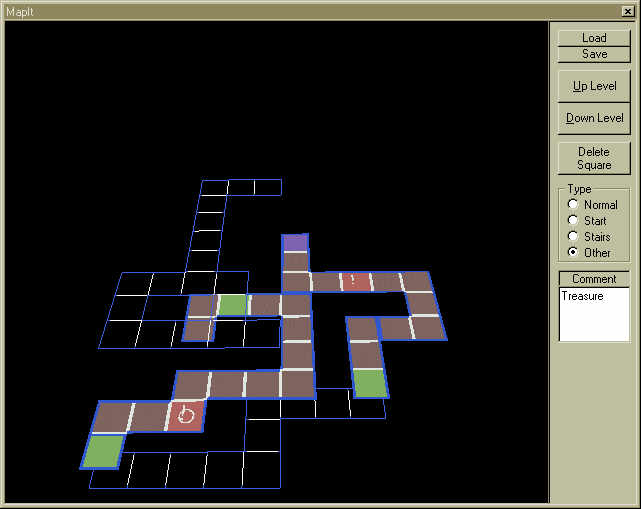



## Dungeon Mapper 3D \(Updated\)

### Description

***REQUIRES DIRECTX 7*** This is a 3D dungeon mapper that is very easy to use. Please see screen-shot. Displays / maps multiple levels within the maze. Great for MUD's, Doom-Wads, and other RPG maze-type games. Use the cursor keys to add 'squares', 'D' to go down a level, 'U' to go up, and 'Delete' to remove a square. Happy Gaming! Comments and/or votes greatly appreciated.
 
### More Info
 

             |
---                |---
**Submitted On**   |2001-06-04 22:14:38
**By**             |[Dave Andrews](https://github.com/Planet-Source-Code/PSCIndex/blob/master/ByAuthor/dave-andrews.md)
**Level**          |Advanced
**User Rating**    |5.0 (25 globes from 5 users)
**Compatibility**  |VB 5\.0
**Category**       |[Complete Applications](https://github.com/Planet-Source-Code/PSCIndex/blob/master/ByCategory/complete-applications__1-27.md)
**World**          |[Visual Basic](https://github.com/Planet-Source-Code/PSCIndex/blob/master/ByWorld/visual-basic.md)
**Archive File**   |[Dungeon Ma20618652001\.zip](https://github.com/Planet-Source-Code/dave-andrews-dungeon-mapper-3d-updated__1-23773/archive/master.zip)

